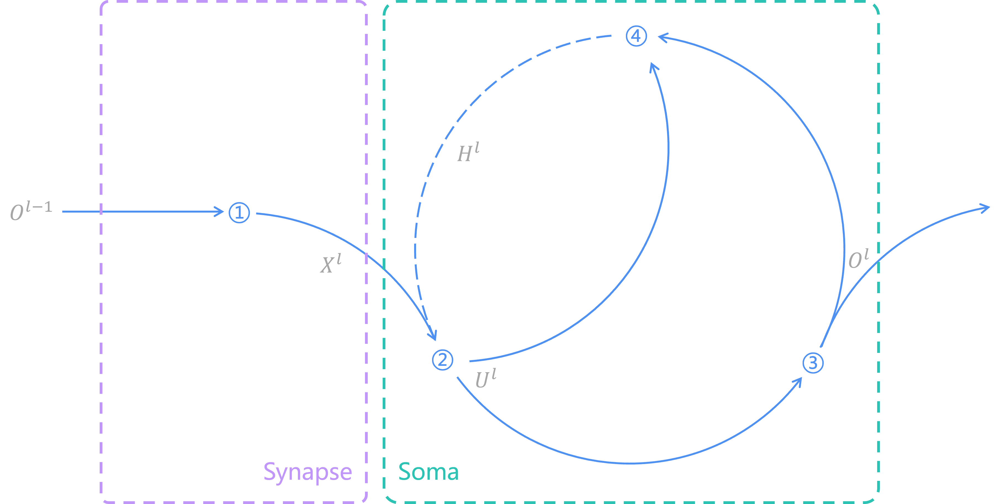
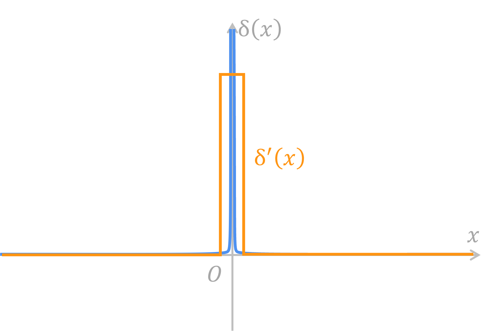
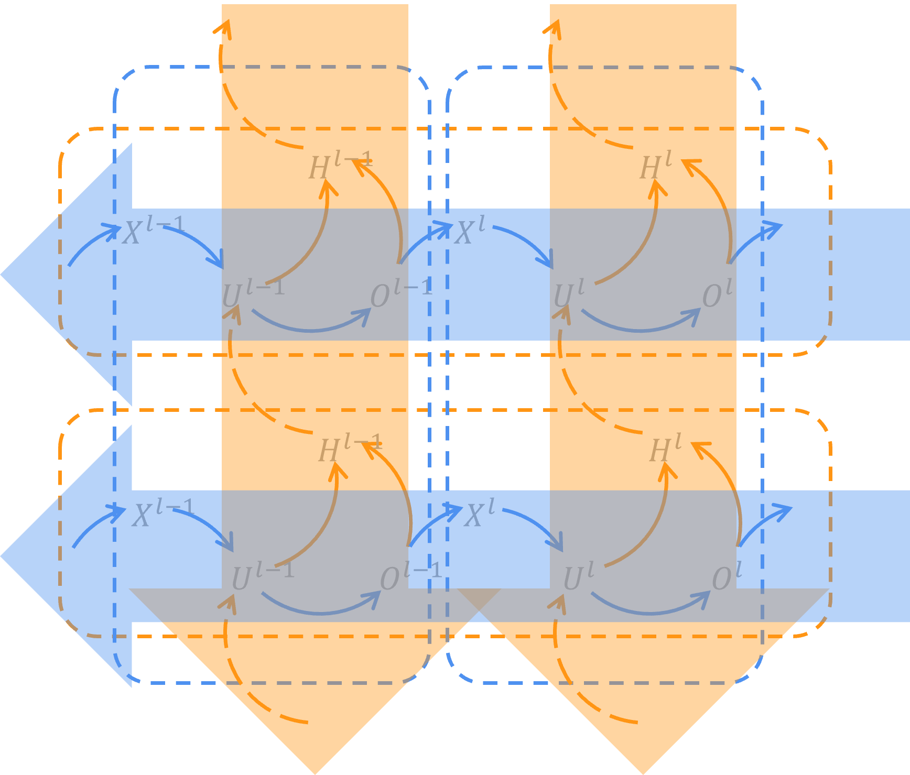
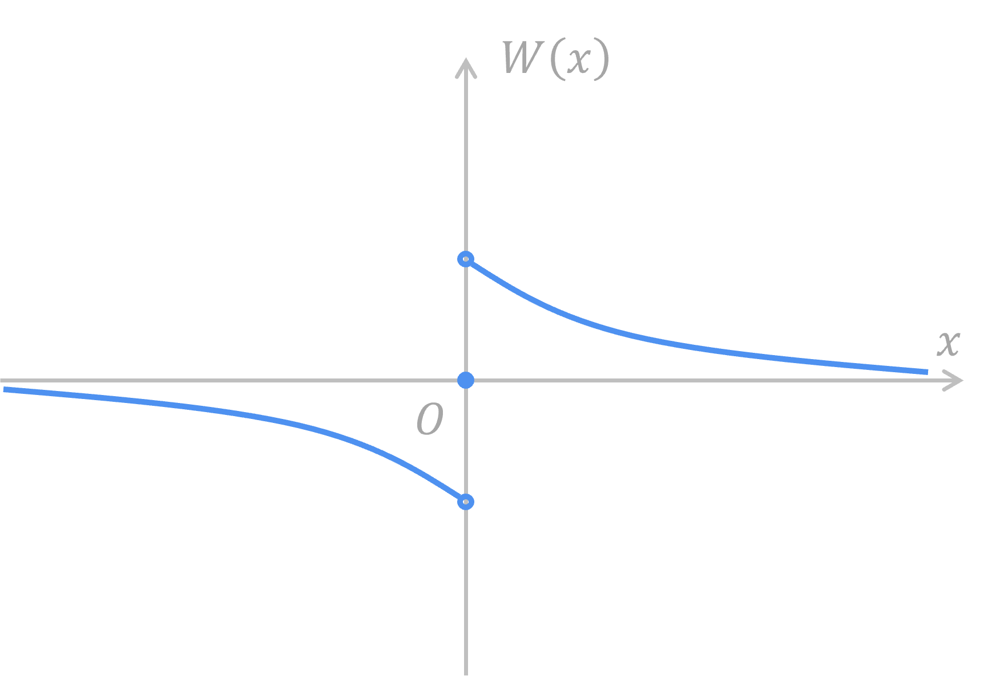

## 3 模块解释

### SNN中的神经元

正如我们所知，下面的图像描述了一个ANN的结构。


**操作1** 是 **突触函数**，它使用权重和偏置来计算从上一层到当前层的值。常用的突触函数包括全连接层 `nn.Linear`，卷积层 `nn.Conv2D` 等。

我们使用一个方程来描述突触函数：

$$Y^{l}=synapse(X^{l-1})$$

这里的 $l$ 表示当前层的编号。

**操作2** 是 **激活函数**，它从突触中过滤信息并将过滤后的信息传递到下一层。常用的激活函数包括 `nn.ReLU`，`nn.Sigmoid` 等。

我们使用一个方程来描述激活函数：

$$X^{l}=activation(Y^{l})$$

总之，ANN中的每一层都有两个功能。我们可以通过以下代码在PyTorch中构建我们的ANN模型：

```python
import torch.nn as nn

model = nn.Sequential(
    nn.Linear(28 * 28, 10),
    nn.ReLU()
)
```

这是一个1层的MLP。它可以将大小为28x28的图像作为输入，并将其分类为10个类别。在这个例子中，ANN的两个方程可以表示为：

$$Y^{l}=W^{l}X^{l-1}+\vec{b}$$

$$X^{l}=ReLU(Y^{l})$$

在SNN中，突触方程与ANN中的相同。然而，SNN中的胞体函数不再像在ANN中那样。在SNN的胞体中，存在一个时间上的循环。下面的图像描述了一个SNN的结构。



**操作1**，**突触函数**，计算来自前一层的脉冲 $O^{l-1}(t)$，从而生成输入电位 $X^{l}(t)$。

我们使用一个方程来描述突触函数：

$$X^{l}(t)=synapse(O^{l-1}(t))$$

通过**操作2**，输入电位，结合历史电位，根据一个一阶微分方程计算，从而生成胞体电位 $U^{l}(t)$。我们将其称为**响应函数**。

我们使用一个方程来描述响应函数：

$$U^{l}(t)=response(H^{l}(t),X^{l}(t))$$

每个脉冲神经元模型都有其独特的响应微分方程。

例如，在LIF神经元中：

$$\tau \frac{du}{dt}=-(u-u_{rest})+RI$$

将其离散化为差分方程，我们可以得到：

$$U^{l}(t)=(1-\frac{1}{\tau})H^{l}(t)+\frac{1}{\tau}u_{rest}+X^{l}(t)$$

**操作3** 使用Heaviside阶跃函数和阈电位 $u_{th}$ 决定是否生成脉冲 $O^{l}(t)$。我们将其称为**脉冲函数**。

我们使用一个方程来描述脉冲函数：

$$O^{l}(t)=spiking(U^{l}(t))$$

通常，脉冲函数看起来像这样。

$$O^{l}(t)=Heaviside(U^{l}(t)-u_{th})$$

其中，Heaviside阶跃函数在输入大于或等于0时返回1，在其他情况下返回0。

**操作4** 的目的是通过输出脉冲 $O^{l}(t)$ 在神经元上设置不应期时间。我们将其称为**重置函数**。

我们使用一个方程来描述重置函数：

$$H^{l}(t)=reset(U^{l}(t-1),O^{l}(t-1))$$

在大多数情况下，我们使用下面的方程来重置电位：

$$H^{l}(t)=U^{l}(t-1)[1-O^{l}(t-1)]+u_{rest}O^{l}(t-1)$$

简而言之，我们使用4个方程来描述SNN神经元。这就是SNN的外观。SNN神经元的形状类似喇叭。其突触将上一个神经元的脉冲转换并将输入响应传递到胞体，在其中有一个等待的时间循环。

通过在时间维度上展开SNN神经元，我们可以得到SNN的时空拓扑网络。


与在PyTorch中构建ANN一样，在Matterhorn中，我们可以通过以下代码构建SNN模型：

```python
import torch
import matterhorn_pytorch.snn as snn

snn_model = snn.Temporal(
    snn.Spatial(
        snn.Linear(28 * 28, 10),
        snn.LIF()
    )
)
```

在代码中，`Spatial` 是Matterhorn的容器之一，用于表示在空间维度上的顺序SNN层，而 `Temporal` 是Matterhorn的另一个容器，用于在时间维度上重复计算电位和脉冲。通过使用 `Spatial` 和 `Temporal`，构建了一个SNN时空拓扑网络，因此可用于训练和评估。

构建的网络以 $n+1$ 维的 `torch.Tensor` 作为输入脉冲序列。它将第一个维度视为时间步长，因此会通过每个时间步骤进行计算。之后，它将生成一个 `torch.Tensor` 作为输出脉冲序列，就像PyTorch中的ANN所接受和生成的那样。唯一的区别，也是一个关键点，是我们应该将信息编码成脉冲序列并解码输出脉冲序列。

### 编码和解码

脉冲序列是时间轴上的Dirac冲击函数的集合。

$$O(t)=\sum_{t_{i}}δ(t-t_{i})$$

换句话说，离散脉冲序列中只会有0和1。因此，我们可以使用一个 $n+1$ 维张量来表示我们的脉冲序列。例如，如果将神经元展平为一维向量，我们可以使用另一个维度来表示时间，从而使其成为一个二维矩阵来表示通过空间和时间的脉冲序列。

$$
\begin{matrix}
 & →s \\
↓t &
\begin{bmatrix}
0 & 1 & 1 & 0 & 1 & 0 & 0 & 1 \\
1 & 0 & 0 & 1 & 0 & 0 & 1 & 1 \\
1 & 1 & 1 & 1 & 1 & 1 & 0 & 1 \\
1 & 0 & 1 & 1 & 0 & 1 & 0 & 1 \\
\end{bmatrix}
\end{matrix}
$$

上面的矩阵显示了一个脉冲序列的样子。它有4行，代表4个时间步。此外，它有8列，代表8个输出神经元。

要将传统的二进制信息（图像、声音等）转换为脉冲序列，需要一个编码器。非事件数据的最常用编码器是泊松编码器，它是一种速率编码器。它将像素的强度视为产生脉冲的概率。

你可以在Matterhorn中使用以下代码使用泊松编码器：

```python
import torch
import matterhorn_pytorch.snn as snn

encoder = snn.PoissonEncoder(
    time_steps = 32
)
```

然后，您可以使用以下代码使用它：

```python
spike_train = encoder(image)
```

形状为 `[H, W, C]` 的图像将被编码为形状为 `[T, H, W, C]` 的脉冲序列。例如，形状为 `[28, 28]` 的MNIST图像将被编码（`T=32`）为形状为 `[32, 28, 28]` 的脉冲序列。

经过编码和处理后，网络将生成一个输出脉冲序列。为了获取信息，我们需要解码。一种常用的解码方法是计算每个输出神经元生成的平均脉冲。

$$o_{i}=\frac{1}{T}\sum_{t=1}^{T}{O_{i}^{K}(t)}$$

你可以在Matterhorn中使用平均解码器的以下代码：

```python
import torch
import matterhorn_pytorch.snn as snn

decoder = snn.AvgSpikeDecoder()
```

它将把第一个维度视为时间维度，并生成统计结果作为输出。输出可以传输到ANN中进行进一步处理。

Matterhorn提供了一个方便的容器 `matterhorn_pytorch.snn.Sequential` 来连接所有的SNN和ANN模型。

```python
import torch
import matterhorn_pytorch.snn as snn

model = snn.Sequential(
    snn.PoissonEncoder(
        time_steps = time_steps,
    ),
    snn.Flatten(),
    snn.Linear(28 * 28, 10, bias = False),
    snn.LIF(tau_m = tau, trainable = True),
    snn.AvgSpikeDecoder()
)
```

到目前为止，您已经体验过SNN的外观以及如何使用Matterhorn构建它。要进行更深入的体验，您可以参考 [examples/2_layer_mlp.py](./examples/2_layer_mlp.py)。

```sh
cd Matterhorn
python3 examples/2_layer_mlp.py
```

在大多数情况下，SNN的神经元可以分为1个突触操作和3个胞体操作。然而，总会有一些特殊情况。SRM0神经元模型是其中之一，其响应在每个突触中计算。我们可以使用5个操作来表示SRM0神经元，其中2个用于突触，3个用于胞体：

**操作1**：**突触响应函数**

$$R_{j}^{l}(t)=(1-\frac{1}{\tau_{m}})R_{j}^{l}(t-1)+O_{j}^{l}(t)$$

**操作2**：**突触函数**

$$X_{i}^{l}(t)=\sum_{j}{w_{ij}R_{j}^{l}(t)}$$

**操作3**：**响应函数**

$$U_{i}^{l}(t)=X_{i}^{l}(t)H_{i}^{l}(t)$$

**操作4**：**脉冲函数**

$$O_{i}^{l}(t)=Heaviside(U_{i}^{l}(t))$$

**操作5**：**重置函数**

$$H_{i}^{l}(t)=1-O_{i}^{l}(t-1)$$

通过5个相似的操作，我们可以构建一个SRM0神经元。要进行更深入的体验，您可以参考 [examples/2_layer_mlp_with_SRM0.py](./examples/2_layer_mlp_with_SRM0.py)。

```sh
cd Matterhorn
python3 examples/2_layer_mlp_with_SRM0.py
```

### 为什么我们需要替代梯度

在脉冲神经元中，我们通常使用Heaviside阶跃函数$u(t)$来决定是否生成脉冲：

$$O^{l}(t)=u(U^{l}(t)-u_{th})$$


然而，Heaviside阶跃函数具有一个导数，可能让每个人都感到头痛。它的导数是Dirac脉冲函数$\delta (t)$。当x等于0时，Dirac脉冲函数是无穷大，否则为0。如果直接用于反向传播，梯度将变得混乱。

因此，我们需要一些函数来替代Dirac脉冲函数，以参与反向传播。我们称这些函数为替代梯度。

其中最常见的替代梯度之一是矩形函数。当x的绝对值足够小时，它是一个正常数，否则为0。



此外，适用于替代梯度的函数还包括S型函数的导数、高斯函数等。

您可以在`matterhorn_pytorch.snn.surrogate`中检查所有提供的替代梯度函数。

### 学习：BPTT 对比 STDP

训练SNN可能和训练ANN一样简单，一旦解决了Heaviside阶跃函数的梯度问题。将SNN展开成空间-时间网络后，就可以在SNN中使用时间反向传播（BPTT）。在空间维度上，梯度可以通过发放函数和突触函数传播，从而前一层的神经元将接收到梯度；在时间维度上，下一个时间步的梯度可以通过发放函数和响应函数传播，从而前一时间的胞体将接收到梯度。



除了BPTT之外，还有另一种在每个神经元中本地无监督训练的简单方法，我们称之为时序相关塑性（STDP）。STDP使用输入和输出脉冲之间的精确时间差异来计算权重增量。

STDP遵循以下方程：

$$Δw_{ij}=\sum_{t_{j}}{\sum_{t_{i}}W(t_{i}-t_{j})}$$

其中权重函数$W(x)$为：

$$
W(x)=
\begin{aligned}
A_{+}e^{-\frac{x}{τ_{+}}},x>0 \\\\
0,x=0 \\\\
-A_{-}e^{\frac{x}{τ_{-}}},x<0
\end{aligned}
$$



通过设置参数$A_{+}$、$τ_{+}$、$A_{-}$和$τ_{-}$，我们可以轻松地进行无监督训练SNN。有关更多体验，请参考[examples/2_layer_mlp_with_stdp.py](./examples/2_layer_mlp_with_stdp.py)。

```sh
cd Matterhorn
python3 examples/2_layer_mlp_with_stdp.py
```

**注意：** 请确保已安装`matterhorn_cpp_extensions`（或者如果有CUDA，则安装`matterhorn_cuda_extensions`），否则速度将非常慢。

```sh
cd matterhorn_cpp_extensions
python3 setup.py install
```

如果有CUDA，您可以安装CUDA版本：

```sh
cd matterhorn_cuda_extensions
python3 setup.py install
```