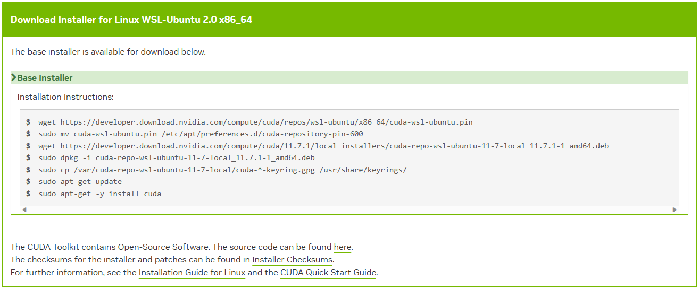

# 开发者须知

## 1 安装


若有意开发Matterhorn，请按照如下方式配置您的环境：

### 1.1 安装Ubuntu 20.04

所有环境均可用于开发Matterhorn，但推荐使用Linux系统。若您的条件不允许（设备不允许安装系统、设备空间不足等），可以跳过此步骤。

[双系统](https://zhuanlan.zhihu.com/p/363640824)、[WSL](https://blog.csdn.net/weixin_43577131/article/details/111928160)或[虚拟机](https://blog.csdn.net/qq_45373920/article/details/122409002)均可，WSL要安装[MobaXTerm](https://mobaxterm.mobatek.net/)并输入如下命令配置GUI：

```sh
sudo apt install x11-apps
```

### 1.2 安装CUDA及CUDNN

若您没有支持CUDA的NVIDIA™显卡，可以跳过此步。推荐安装[CUDA 11.7.1](https://developer.nvidia.com/cuda-11-7-1-download-archive)版本。

#### Linux用户

点击链接[https://developer.nvidia.com/cuda-11-7-1-download-archive](https://developer.nvidia.com/cuda-11-7-1-download-archive)，选择如下选项进行安装：

若您是双系统或虚拟机用户，请进行如下选择：


若您是WSL用户，请进行如下选择：


随后，页面下方会弹出相关命令行：



请依次复制命令进行CUDA的安装。

在CUDA安装完成之后，请于[https://developer.nvidia.com/zh-cn/cudnn](https://developer.nvidia.com/zh-cn/cudnn)，按照页面指引下载适用于CUDA 11.x的CUDNN并安装。

**请注意：** 虽然执行完以上步骤之后，CUDA及CUDNN均安装完成，但在执行时，它们并不会自动被激活。此时需要我们在`~/.bashrc`中加入自启动代码：

（1）使用`vim`（或文本编辑器等）打开`~/.bashrc`；

```sh
sudo apt install vim
sudo vim ~/.bashrc
```

（2）随后，命令行会弹出`~/.bashrc`中的内容。将光标移至文件末尾，按下`I`键开启编辑，并在结尾处插入如下代码：

```sh
function switch_cuda {
   v=$1
   export PATH=/usr/local/cuda-$v/bin:$PATH
   export CUDADIR=/usr/local/cuda-$v
   export CUDA_HOME=/usr/local/cuda-$v
   export LD_LIBRARY_PATH=/usr/local/cuda-$v/lib64:$LD_LIBRARY_PATH
}
switch_cuda 11.7
```

（3）插入后，按下`esc`键开启命令输入，并输入

```sh
:wq
```

以保存并退出；

（4）关闭命令行或输入

```sh
source ~/.bashrc
```

以使CUDA在命令行中生效。

**测试**

安装好后，在命令行中输入

```sh
nvcc --version
```

若无报错，且观察到版本号为11.7.1，即代表安装成功。

#### Windows用户

请参考教程[https://zhuanlan.zhihu.com/p/99880204](https://zhuanlan.zhihu.com/p/99880204)安装。推荐安装CUDA 11.7.1版本。

**测试**

安装好后，在命令行中输入

```sh
nvcc --version
```

若无报错，且观察到版本号为11.7.1，即代表安装成功。

### 1.3 安装基础依赖（GIT和Python）

#### Windows用户

首先安装Chocolatey（Windows的包管理器）：

右键右下角Windows图标，选择“命令提示符（管理员）”或“终端（管理员）”（若终端默认为`cmd`），随后输入

```sh
@"%SystemRoot%\System32\WindowsPowerShell\v1.0\powershell.exe" -NoProfile -InputFormat None -ExecutionPolicy Bypass -Command "iex ((New-Object System.Net.WebClient).DownloadString('https://chocolatey.org/install.ps1'))" && SET "PATH=%PATH%;%ALLUSERSPROFILE%\chocolatey\bin"
```

或选择“PowerShell（管理员）”或“终端（管理员）”（若终端默认为`powershell`），随后输入

```sh
Set-ExecutionPolicy Bypass -Scope Process -Force; iex ((New-Object System.Net.WebClient).DownloadString('https://chocolatey.org/install.ps1'))
```

按照指示步骤安装即可。安装好后，关闭当前命令行，开启新的命令行。

随后，在命令行中输入

```sh
choco install git
```

当GIT安装完成后，前往[https://mirrors.tuna.tsinghua.edu.cn/anaconda/archive/Anaconda3-2020.11-Windows-x86_64.exe](https://mirrors.tuna.tsinghua.edu.cn/anaconda/archive/Anaconda3-2020.11-Windows-x86_64.exe)下载并安装Anaconda（基础环境为Python 3.8）。 **注意：** 一定要将conda环境加入PATH（当出现“add ... to PATH”时，请勾选它）。

**测试**

随后，在命令行输入

```sh
git --help
python --help
pip --help
```

分别查看是否安装成功。若无报错，则表明安装成功。

#### MacOS用户

首先安装Homebrew（MacOS的包管理器）：

打开“终端”应用，输入

```sh
# 国外（或科学上网）
/bin/bash -c "$(curl -fsSL https://raw.githubusercontent.com/Homebrew/install/HEAD/install.sh)"
# 国内
/bin/zsh -c "$(curl -fsSL https://gitee.com/cunkai/HomebrewCN/raw/master/Homebrew.sh)"
```

按照指示步骤安装即可。安装好后，关闭当前命令行，开启新的命令行。

随后，在命令行中输入

```sh
brew install git
```

当GIT安装完成后，前往[https://mirrors.tuna.tsinghua.edu.cn/anaconda/archive/Anaconda3-2020.11-MacOSX-x86_64.pkg](https://mirrors.tuna.tsinghua.edu.cn/anaconda/archive/Anaconda3-2020.11-MacOSX-x86_64.pkg)下载并安装Anaconda（基础环境为Python 3.8）。

**测试**

随后，在命令行输入

```sh
git --help
python --help
pip --help
```

分别查看是否安装成功。若无报错，则表明安装成功。

#### Linux用户

首先更新APT源。在命令行中输入

```sh
sudo apt update
```

更新，随后，在命令行中输入

```sh
sudo apt install git python3-pip python-is-python3
```

安装GIT和PIP。 **注意：** Ubuntu 20.04自带的Python版本为3.8，因此不必重新安装Anaconda；但自带的Python是没有PIP的，需要手动安装。

**测试**

随后，在命令行输入

```sh
git --help
python3 --help
pip3 --help
```

分别查看是否安装成功。若无报错，则表明安装成功。

### 1.4 安装PyTorch

复制自[PyTorch历史版本](https://pytorch.org/get-started/previous-versions/)页面，建议安装1.13.1版本作为开发。

#### MacOS用户

```sh
pip install torch==1.13.1 torchvision==0.14.1 torchaudio==0.13.1
```

#### Windows或Linux用户

```sh
# 对 ROCM 5.2 （AMD™显卡的机器学习库，仅限Linux或WSL）
pip install torch==1.13.1+rocm5.2 torchvision==0.14.1+rocm5.2 torchaudio==0.13.1 --extra-index-url https://download.pytorch.org/whl/rocm5.2
# 对 CUDA 11.6
pip install torch==1.13.1+cu116 torchvision==0.14.1+cu116 torchaudio==0.13.1 --extra-index-url https://download.pytorch.org/whl/cu116
# 对 CUDA 11.7 （若已安装CUDA，选择这个版本）
pip install torch==1.13.1+cu117 torchvision==0.14.1+cu117 torchaudio==0.13.1 --extra-index-url https://download.pytorch.org/whl/cu117
# 对 CPU（若无法安装CUDA，选择这个版本）
pip install torch==1.13.1+cpu torchvision==0.14.1+cpu torchaudio==0.13.1 --extra-index-url https://download.pytorch.org/whl/cpu
```

**测试**

当安装好后，打开命令行，输入

```sh
# Windows或MacOS
python
# Ubuntu 20.04
python3
```

启动Python，随后输入

```python
import torch
```

，若没有报错，则代表PyTorch已经安装成功。

若您所安装的是CUDA版本的PyTorch，请继续输入

```python
torch.cuda.is_available()
```

若命令行返回

```python
True
```

则代表PyTorch的CUDA扩展是可用的，可以使用GPU进行机器学习。

### 1.5 下载VSCode

在VSCode官网[https://code.visualstudio.com/](https://code.visualstudio.com/)下载VSCode并安装。 **注意：** 尽量挂梯子或使用IDM等下载器，否则巨慢无比。

### 1.6 在本地部署Matterhorn的GIT仓库

不同于`README`中所述`git clone`的方式，若希望进一步开发，我们需要在本地初始化GIT仓库，随后与远端同步。输入

```sh
# MacOS 和 Linux
cd ~
# Windows
cd c:\\Users\\[用户名]
mkdir matterhorn
cd matterhorn
```

在主文件夹下创建工作目录，随后输入

```sh
git init
```

初始化新的GIT仓库后，输入

```sh
git remote add origin https://github.com/AmperiaWang/Matterhorn.git
```

将本地仓库与远程仓库相链接。

执行

```sh
git pull origin main
```

可以将最新的代码由远端的`main`分支拉取至本地仓库。

**注意：** 在第一次拉取时，请执行

```sh
git branch -M master main
```

以将本地的分支由`master`修改为`main`，与远端分支同步。

随后可以在VSCode中打开`matterhorn`文件夹，对代码进行修改与调试。如果是第一次运行，VSCode会自动安装中文扩展与Python扩展。建议将VSCode中“文件”选项的“自动保存”勾选，以自动保存代码的修改。

当代码修改完成后，请执行

```sh
git add .
git commit -m "[修改说明]"
```

以将所执行的修改提交到本地分支之中。若要与远端分支同步修改，请先执行

```sh
git pull origin main
```

以与远端分支中其他人提交的代码合并并解决您与其他人在代码上的冲突，随后执行

```sh
git push origin main
```

将您的代码提交至远端仓库。

## 2 代码规范

除非特殊情况，该章中所有的“代码”均指代Python代码。

### 2.1 变量名、类名、文件名

首先介绍3种命名格式：大驼峰、小驼峰和下划线命名。

```python
# 大驼峰，所有单词的首字母均大写，其余字母小写（除非原本就需要大写，如缩写），单词之间无空格
BigCamelCase = True
VariableA = 1
Numpy2Tensor3D = lambda x: torch.tensor(x)

# 小驼峰，首字母小写（除非原本就需要大写，如缩写），每个单词的第一个字母大写，其余字母小写（除非原本就需要大写，如缩写），单词之间无空格
smallCamelCase = True
variableA = 1
numpy2Tensor3D = lambda x: torch.tensor(x)

# 下划线，所有字母均小写（除非原本就需要大写，如缩写），单词之间以下划线作为空格
underline_case = True
variable_A = 1
numpy_2_tensor_3D = lambda x: torch.tensor(x)
```

在Matterhorn的命名中，变量名、函数名、参数名与文件名均需为下划线格式：

```python
# 变量命名采用下划线格式
root_dir = "~/data"

# 函数名、函数参数的命名采用下划线格式
def add_tensor_in_row(mat_add: torch.Tensor, vec_add: torch.Tensor) -> torch.Tensor:
   return (mat.T + vec).T
```

```sh
# 文件的命名采用下划线格式
cd matterhorn/snn
touch test_1.py
rm test_1.py
```

类的命名使用大驼峰格式：

```python
# 类的命名采用大驼峰格式
class WhateverItWillBe(nn.Module):
   def __init__(self) -> None:
      super().__init__()
   
   # 类内函数的命名采用下划线格式
   def forward(x: torch.Tensor) -> torch.Tensor:
      return x
```

常量的命名使用下划线格式，但所有字母均大写：

```python
# 常量的命名使用全大写下划线格式
CONSTANT_X = 16
```

所有变量或函数的命名均要体现其功能，切不可随意使用`a`、`b`、`c`等单个字母命名（除非通过单个字母即可了解其功能）：

```python
# 错误示范（写完不出3个月就不知道a是什么了，而且太容易重名）
def a(m: torch.Tensor, v: torch.Tensor) -> torch.Tensor:
   return (m.T + v).T

# 正确示范（一看就知道是矩阵行相加）
def add_tensor_in_row(mat_add: torch.Tensor, vec_add: torch.Tensor) -> torch.Tensor:
   return (mat.T + vec).T
```

变量或函数的命名不可过于冗长，以简明扼要为主：

```python
# 错误示范（函数名贼长，小屏幕一眼只能看到函数名，分辨出是什么函数还要好半天）
def add_a_vector_tensor_into_a_mat_by_its_row_and_get_result(mat_add: torch.Tensor, vec_add: torch.Tensor) -> torch.Tensor:
   return (mat.T + vec).T

# 正确示范（函数名简短而且一眼知道其含义）
def add_tensor_in_row(mat_add: torch.Tensor, vec_add: torch.Tensor) -> torch.Tensor:
   return (mat.T + vec).T
```

涉及到空间维度的遍历，计数单位以如下顺序嵌套命名：

```python
i, j, m, n, p, q, r, s
```

例如：

```python
mat = torch.Tensor(3, 5)
rows = mat.shape[0]
cols = mat.shape[1]
for i in range(rows):
   for j in range(cols):
      print(mat[i, j])
```

涉及到时间维度的遍历，计数单位统一以`t`命名。若涉及到多个时间计数单位（如STDP需要同时考虑`t_i`和`t_j`），以简明扼要的形式指定下标，和`t`之间用下划线隔开：

```python
for i in range(output_shape):
   for j in range(input_shape):
      for t_i in range(time_steps):
         for t_j in range(time_steps):
            w += stdp_weight_delta(output_spike_train[i, t_i], input_spike_train[j, t_j])
```

### 2.2 代码注释规范

在文件最开头的位置，用多行注释的形式写上该文件的简介：

```python
"""
解析AEDAT文件，并将其转化为事件张量。
"""
```

在函数头与函数体之间，用多行注释的形式写上该函数的简介、参数表及返回值表；参数表的开头用`@params:`表示，并且每个参数单独一行；返回值表的开头用`@return`表示，并且每个返回值单独一行：

```python
def add_tensor_in_row(mat_add: torch.Tensor, vec_add: torch.Tensor) -> torch.Tensor:
   """
   将向量加到矩阵的行上。
   @params:
      mat_add: torch.Tensor 被加的矩阵，一个形状为mxn的矩阵
      vec_add: torch.Tensor 用于相加的向量，一个形状为m的向量
   @return:
      torch.Tensor 相加后的结果，一个形状为mxn的矩阵
   """
   return (mat.T + vec).T
```

该方法对全局函数和类内函数均适用。

其余注释应当在合适的时机以单行或多行的形式标出，切不可乱加注释。

### 2.3 代码间距规范

函数与函数（类外和类内都是）、类与类、类与函数之间均空两行：

```python
def demo_func_a() -> None:
   return


def demo_func_b() -> None:
   print("函数之间空两行")
   return


class DemoClassA:
   def __init__(self) -> None:
      print("函数与类之间空两行")
      return


   def func_a(self) -> None:
      print("类内函数之间空两行")
      return


class DemoClassB:
   def __init__(self) -> None:
      print("类与类之间空两行")
      return
```

默认的缩进为4个空格。如果您的IDE默认缩进不是4个空格，请修改其配置。

```python
def a() -> None:
   """
   1个缩进 = 4个空格
   """
   return
```

操作符（除取下标中的`:`操作符、点号与括号等特殊操作符之外）与变量之间使用一个空格隔开：

```python
c = a + b
print(c * 3)
```

当函数中的参数大于一个需要用逗号隔开时，逗号左边紧邻变量，右边与下一个变量之间使用一个空格隔开：

```python
def add_tensor_in_row(mat_add: torch.Tensor, vec_add: torch.Tensor) -> torch.Tensor:
   """
   参考"mat_add: torch.Tensor, vec_add: torch.Tensor"这段的规范
   """
   return (mat.T + vec).T
```

函数的参数名与其类型之间用冒号隔开，冒号左边紧邻参数名，右边与参数类型之间使用一个空格隔开：

```python
def add_tensor_in_row(mat_add: torch.Tensor, vec_add: torch.Tensor) -> torch.Tensor:
   """
   参考"mat_add: torch.Tensor"这段的规范
   """
   return (mat.T + vec).T
```

### 2.4 其它规范

所有函数的参数与返回值必须指明其类型，参数用`var: type`指定，返回值用` -> type`指定：

```python
def add(num_1: int, num_2: int = 0) -> int:
   return num_1 + num_2
```

Python的`typing`类中含有很多类型的定义：

```python
# int、float和str是可以直接使用作类型的
demo_var: int = 1
demo_var: float = 1.5
demo_var: str = "Hello, world"
# 列表类型不能直接用list表示，应当先引用后再用typing的List表示，以下同理
from typing import List
demo_var: List = [1, 2, 3]
# 元组类型
from typing import Tuple
demo_var: Tuple = (1, 2, 3)
# 字典类型
from typing import Dict
demo_var: Dict = {"a": 1, "b": 2}
# 列表、元组、字典或其它可遍历的类型统称
from typing import Iterable
demo_var: Iterable
# 当参数或返回值有多个类型的时候，使用Union
from typing import Union
demo_var: Union[int, float]
# 当参数有可能为None时，使用Optional
from typing import Optional
demo_var: Optional[int] = None
# 若您不知道是什么类型，请使用Any，尽量少用
from typing import Any
demo_var: Any
```

其余变量可以选择性指明类型。

需要注意：类中非静态函数的第一个变量`self`不必指定其类型。

在参数传递时，尽量使用按引用传参：

```python
def add_tensor_in_row(mat_add: torch.Tensor, vec_add: torch.Tensor) -> torch.Tensor:
   """
   将向量加到矩阵的行上。
   @params:
      mat_add: torch.Tensor 被加的矩阵，一个形状为mxn的矩阵
      vec_add: torch.Tensor 用于相加的向量，一个形状为m的向量
   @return:
      torch.Tensor 相加后的结果，一个形状为mxn的矩阵
   """
   return (mat.T + vec).T


demo_mat = torch.Tensor(3, 5)
demo_vec = torch.Tensor(3)
demo_res = add_tensor_in_row(mat_add = demo_mat, vec_add = demo_vec)
```